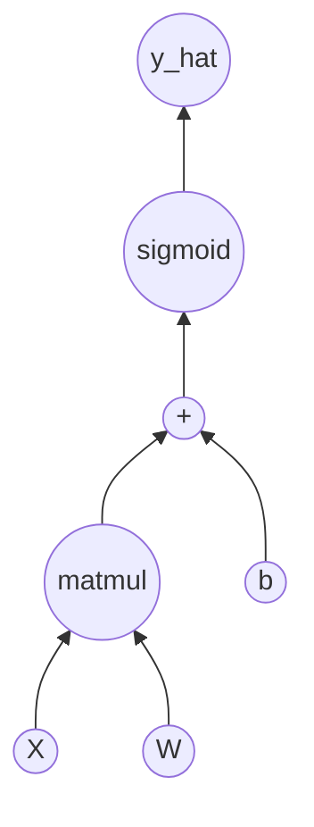
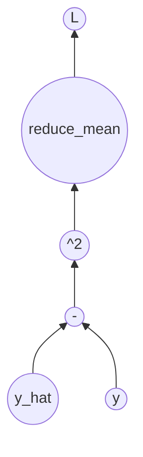
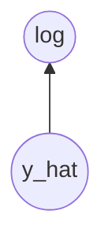

```mermaid
flowchart BT
    X((X)) --> matmul((matmul))
    W((W)) --> matmul
    matmul --> +((+))
    b((b)) --> +
    + --> sigmoid((sigmoid))
    sigmoid --> y((y_hat))
```

```mermaid
flowchart BT
    y_hat((y_hat)) --> sub
    y((y)) --> sub(("-"))
    sub --> square((^2))
    square --> reduce_mean((reduce_mean))
    reduce_mean --> L((L))
```

```mermaid
flowchart BT
    y_hat((y_hat)) --> log_1((log))
```
